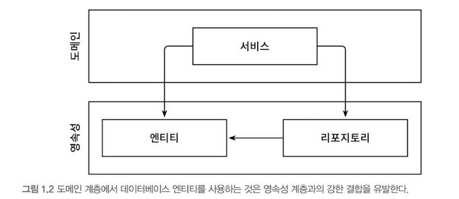
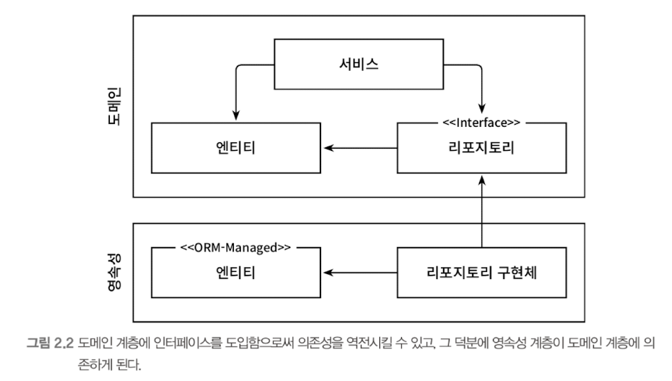
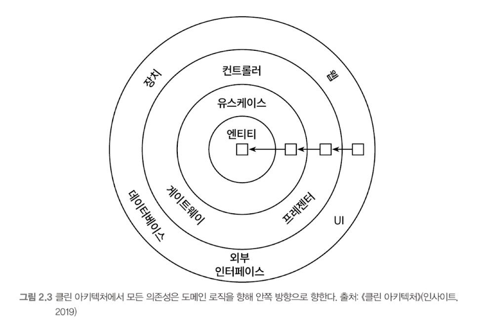
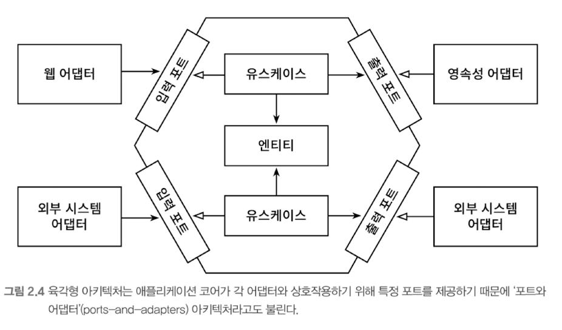

# Chapter 02. 의존성 역전하기

## 단일 책임 원칙
- 흔히 단일 책임 원칙을 "하나의 컴포넌트는 오로지 한가지 일만 해야한다" 로 해석한다. 하지만 실제 정의는 **"컴포넌트를 변경하는 이유는 오직 하나뿐이어야 한다"** 이다.
- `책임` 은 사실 오로지 한 가지 일만 하는 것 보다는 `변경할 이유` 로 해석해야 한다.
- 컴포넌트를 변경할 이유가 1가지라면, 어떤 다른 이유로 소프트웨어를 변경하더라도 이 컴포넌트에 대해서는 신경 쓸 필요가 없다.

## 의존성 역전 원칙
- 코드상의 어떤 의존성이든 그 방향을 바꿀 수 (역전시킬 수) 있다
  - 이게 가능하기 위해서는, 의존성의 양쪽 코드를 모두 제어할 수 있을 때만 의존성을 역전시킬 수 있다

- 이 상태에서 영속성 코드가 도메인 코드에 의존하도록 만들어서, 도메인 계층과 영속성 계층 간의 `순환 의존성` 을 만들어보자
  - 도메인 객체를 표현하고, 도메인 코드는 엔티티들의 상태를 변경하는 일을 중심으로 하기에 엔티티를 영속성 계층에서 도메인 계층으로 옮기면 가능하다.
  - **이 부분에 바로 DIP 를 적용하면 된다.  도메인 계층에 리포지토리에 대한 인터페이스를 만들고, 실제 리포지토리는 영속성 계층에서 구현하는 것이다**

## 클린 아키텍처
- 도메인 코드가 바깥으로 향하는 어떠한 의존성도 없어야 한다.  **의존성 역전 원칙의 도움으로 모든 의존성이 도메인 코드를 향해야 한다.**

- 위 아키텍처에서 가장 주요한 규칙은, "계층간의 모든 의존성이 안쪽으로 향해야 한다"는 것이다
- `유스케이스` : 서비스라고 불렀던 것들인데, 단일 책임 (즉, 변경할 단 한가지의 이유) 을 갖기 위해 세분화되었다
- 바깥쪽 계층들은 다른 서드파티 컴포넌트에 어댑터를 제공할 수 있다
- 도메인 계층이 영속성, UI 계층과 같은 외부 계층과 철저히 분리되어야 하므로 애플리케이션 엔티티에 대한 모델을 각 계층에서 유지보수 해야 한다는 대가가 따른다.
  - 도메인 계층에서 사용한 엔티티 클래스를 영속성 계층에서 함께 사용할 수 없고, 두 계층에서 각각 엔티티를 만들어야 한다

## 육각형 아키텍처 (헥사고날 아키텍처)

- 왼쪽에 있는 어댑터 : 애플리케이션 코어를 호출하기에, 애플리케이션을 주도하는 어댑터
  - **주도하는 어댑터 (driving adapter) 가 호출해야 할 포트는 코어에 있는 유스케이스 클래스 중 하나에 의해 구현된다**
- 오른쪽에 있는 어댑터 : 애플리케이션 코어에 의해 호출되기에, 애플리케이션에 의해 주도되는 어댑터
  - **주도되는 어댑터 (driven adapter) 에 포트가 구현되고, 코어에 의해 호출되는 인터페이스가 된다.**
- 이 아키텍처 스타일은 '포트와 어댑터' 아키텍처로도 알려져 있다
- **포트 + 유스케이스 구현체를 결합해서** 애플리케이션의 인터페이스를 정의하기 때문에 두 가지로 **애플리케이션 계층을 구성할 수 있다**

## 유지보수 가능한 소프트웨어를 만드는 데 어떻게 도움이 될까?
- 이 아키텍처를 통해, 의존성을 역전시켜 도메인 코드가 다른 바깥쪽 코드에 의존하지 않게 할 수 있다
- 따라서 영속성, UI 에 특화된 모든 문제로부터 **도메인 로직의 결합 제거하고, 코드를 변경할 케이스의 수를 줄일 수 있게 된다**