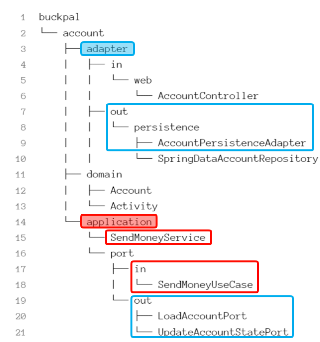
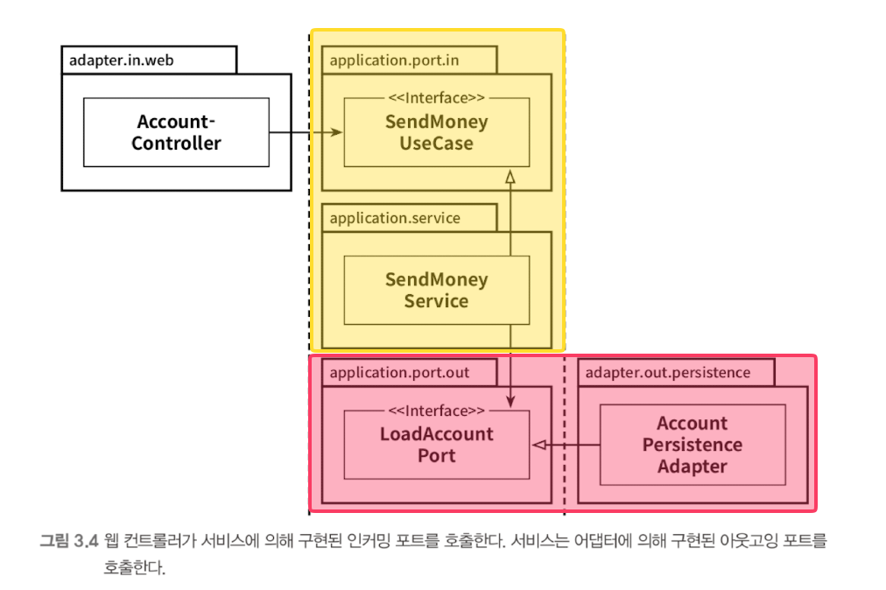

# Chapter 03. 코드 구성하기
## 아키텍처적으로 표현력 있는 패키지 구조

- application 패키지 : 도메인 모델을 둘러싼 서비스 계층을 포함
  - SendMoneyService 는 인커밍 포트 인터페이스인 SendMoneyUseCase 를 구현한다.   아웃고잉 포트 인터페이스이자 영속성 어댑터에 의해 구현된 LoadAccountPort, UpdateAccountStatePort 를 사용한다.
- adapter 패키지
  - **애플리케이션 계층의 인커밍 포트를 호출하는 인커밍 어댑터 + 애플리케이션 계층의 아웃고잉 포트에 대한 구현을 제공하는 아웃고잉 어댑터 포함**
- 이 패키지 구조는 표현력이 있기 때문에 '아키텍처 - 코드 갭' 혹은 '모델 - 코드 갭' 을 효과적으로 다룰 수 있다.
- DDD 개념에 직접적으로 대응시킬 수 있다.
  - account 와 같은 상위 레벨 패키지는 다른 `바운디드 컨텍스트` 와 통신할 전용 진입점, 출구(포트) 를 포함하는 바운디드 컨텍스트에 해당한다

## 의존성 주입의 역할

- 아웃고잉 어댑터에 대해서는 제어 흐름의 반대 방향으로 의존성을 돌리기 위해, 의존성 역전 원칙을 이용해야 한다
  - **애플리케이션 계층에 인터페이스 (출력 포트) 생성 + 어댑터에 해당 인터페이스 (출력 포트) 를 구현한 클래스를 두는 방식으로 구현한다**
  - 육각형 아키텍처에서는 이 인터페이스가 포트다.

