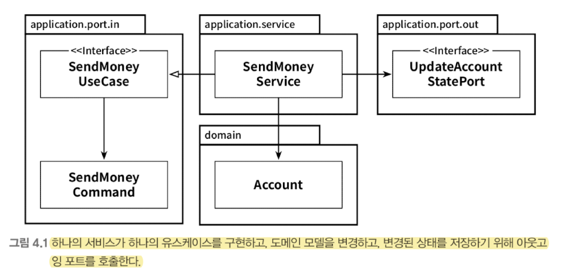

# Chapter 04. 유스케이스 구현하기

## 유스케이스 둘러보기

1. 입력 받기
   - 인커밍 어댑터로부터 입력을 받는다
2. 비즈니스 규칙 검증
    - 유스케이스는 비즈니스 규칙을 검증할 책임이 있고, 도메인 엔티티와 이 책임을 공유한다
3. 모델 상태 조작
    - 비즈니스 규칙 충족 시, 유스케이스는 입력을 기반으로 모델 상태를 변경한다
4. 출력 반환
    - 영속성 어댑터를 통해 구현된 포트로 이 상태를 전달해서 저장될 수 있게 한다

## 입력 유효성 검증
- 유스케이스는 하나 이상의 어댑터에서 호출될텐데, 유효성 검증을 각 어댑터에서 모두 구현해야 한다면 휴먼 에러가 발생할 여지가 많다
- 따라서 유스케이스 클래스가 아닌 `입력 모델` 클래스 (ex. SendMoneyCommand) 가 유효성 검증의 책임을 가지도록 한다
  - 입력 모델은 유스케이스 API 의 일부이기에, 인커밍 포트 패키지에 위치한다
- 입력 모델에 있는 유효성 검증 코드를 통해, 유스케이스 구현체 주위에 사실상 오류 방지 계층을 만든 것이다

## 유스케이스마다 다른 입력 모델
- 각 유스케이스 전용 입력 모델을 사용하면 유스케이스를 훨씬 명확하게 만들고, 다른 유스케이스와의 결합도를 제거함으로써 불필요한 부수효과를 방지할 수 있다

## 비즈니스 규칙 검증하기
- 비즈니스 규칙 검증은 도메인 모델의 현재 상태에 접근해야 하지만, 입력 유효성 검증은 그럴 필요가 없다
- `입력 유효성 검증` : **구문상의 (syntactical) 유효성 검증**
- `비즈니스 규칙 검증` : **유스케이스 맥락 속에서 의미적인 (semantical) 유효성 검증**
  - 비즈니스 규칙은 도메인 엔티티에서 검증하도록 한다

## 유스케이스마다 다른 출력 모델
- 입력 모델과 유사하게 출력 모델의 경우에도 각 유스케이스에 맞게 구체적일수록 좋다
- 유스케이스들 간에 같은 출력 모델 공유 시, 유스케이스들도 강하게 결합되므로 단일 책임 원칙을 적용하여 모델을 분리하는 것이 강결합을 제거하는데 도움이 된다

## 읽기 전용 유스케이스는 어떨까?
- "계좌 잔고 보여주기" 로 불리는 특정 유스케이스를 구현하기 위해 데이터가 필요할 수 있다.  전체 프로젝트 맥락에서 이런 작업이 유스케이스로 분류된다면, 다른 유스케이스와 비슷한 방식으로 구현해야 한다.
- 하지만, 애플리케이션 코어 관점에서 이 작업은 간단한 데이터 쿼리로 처리 가능하므로, **프로젝트 맥락 상 유스케이스로 간주되지 않는다면 실제 유스케이스와 구분하기 위해 쿼리로 구현할 수 있다**
  - **쿼리를 위한 인커밍 전용 포트 생성 -> 포트를 쿼리 서비스에서 구현하는 방식을 사용할 수 있다**
- 읽기 전용 쿼리는 쓰기가 가능한 유스케이스 ("커맨드") 와 코드 상에서 명확히 구분된다.
  - CQS, CQRS 와 같은 개념과 아주 잘 맞는다.

## 유지보수 가능한 소프트웨어를 만드는 데 어떻게 도움이 될까?
- 입출력 모델을 독립적으로 모델링한다면, 원치 않는 부수효과를 피할 수 있다
- 유스케이스 간에 모델을 공유하는 것보다 더 많은 작업이 필요하긴 하나, **유스케이스별로 모델을 생성할 경우 유스케이스를 명확히 이해하고 장기적으로는 유지보수하기 쉬울 수 있다**